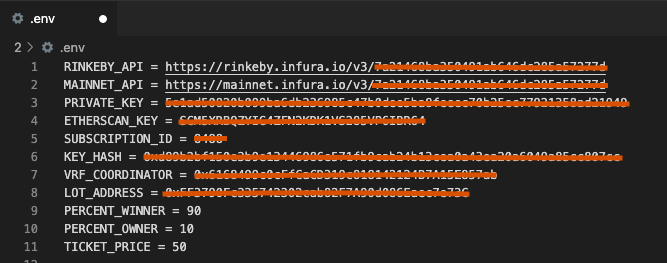

# ♠ Lottery ♣
> Lottery contract with VRF2
> Contract is using VRFv2 for generating random numbers. Therefore, for the correct operation of the contract, it is necessary to create subscription on > https://vrf.chain.link/rinkeby for rinkeby testnet or https://vrf.chain.link/mainnet for mainnet, replenish the balance of LINK and add contract address as a consumer

## 📁 Table of Contents
* [General Info](#-general-information)
* [Technologies Used](#-technologies-used)
* [Features](#-features)
* [Requirements For Initial Setup](#-requirements-for-initial-setup)
* [Setup](#-setup)
* [Contact](#-contact)


## 🚩 General Information
- Owner(admin) of the contract can start/end lottery
- Every user can participate and price of ticket is based on LOT ERC20 tokens. Each ticket represents itself an ERC721 token
- After owner end lottery, the winner will be picked using randomness from Chainlink VRFv2 Coordinator

 
## 💻 Technologies Used
- Chainlink VRFv2
- hh coverage
- slither
- docgen

## 🌟 Features
- Trully random contract(Ideally for lottery)
- Ticket price is based LOT tokens
- The contract has been properly reviewed.

## 👀 Requirements For Initial Setup
- Install [NodeJS](https://nodejs.org/en/), should work with any node version below 16.16.0
- Install [Hardhat](https://hardhat.org/)

## 📟 Setup
### 1. 💾 Clone/Download the Repository
### 2. 📦 Install Dependencies:
```
$ cd lottery_file
$ npm install
```
### 3. 🔍  .env environment variables required to set up
Create .env file inside project folder
- You can get your ethereum or testnet API key [here](https://infura.io/dashboard/ethereum),[here](https://www.alchemy.com) or any other service that allow you to connect to the nodes
- You can get your private key from your wallet (Don't share your private key with untrusted parties) 
- Subscription id can be obtained here after creation of subscription [here](https://vrf.chain.link)
- Key Hash and address of vrf coordinator can be obtained from here [here](https://docs.chain.link/docs/vrf-contracts) Just choose network and copy:)
- You can get your etherscan API -key [here](https://etherscan.io/myapikey).
- LOT_ADDRESS be available after deploying contracts
```
RINKEBY_API = <Rinkeby API key>
MAINNET_API = <Ethereum mainnet API key>
PRIVATE_KEY = <Private key of your wallet u want to deploy contracts from>
ETHERSCAN_KEY = <Etherscan API key in order to verify your contracts>
SUBSCRIPTION_ID = <VRFv2 subcription id>
KEY_HASH = <Key Hash>
AGGREGATOR = <Aggregator address(depends on network)>
VRF_COORDINATOR = <VRF coordinator address(depends on network)>
LOT_ADDRESS = <Address of deployed LOT.sol contract>
PERCENT_WINNER = <Percent of total collected funds of lottery winner will receive(PERCENT_WINNER+PERCENT_OWNER must be 100)>
PERCENT_OWNER = <Percent of total collected funds of lottery winner will receive(PERCENT_WINNER+PERCENT_OWNER must be 100)>
TICKET_PRICE = <Price in LOT tokens in order to participate in Lottery>
```


### 4. ⚠️ Run Tests
```
$ npm run test
```

```
$ npm run coverage
```

### 5. 🚀 Deploy to Rinkeby or Mainnet
```
$ npm run deployRinkeby
``` 
```
$ npm run deployMainnet 
``` 

!!!Important!!! 
insert current token contract address into your environment variables

### 6. ✏️ Insert current contract addresses into package.json


### 7. 📜 Verify contracts
```
$ npm run verifyRinkebyLOT 
```

```
 $ npm run verifyRinkebyLottery
```
or for mainnet
```
$ npm run verifyLOT
```

```
 $ npm run verifyLottery
```


## 💬 Contact
Created by [@LESKOV](https://www.linkedin.com/in/ivan-leskov-4b5664189/) - feel free to contact me!
